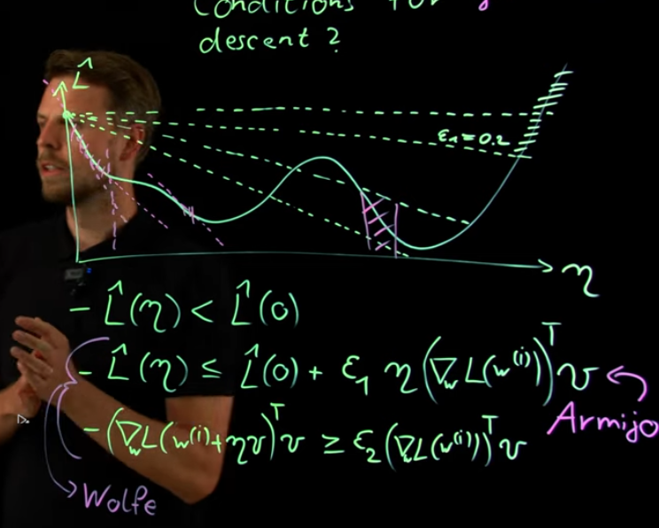

1. why dL/dx* = 0 is necessity for L = f+ƛ1*g1 + ƛ2*g2 + ƛ3*g3+...?
g1,g2,g3,....<=0
prove:
suppose d is a direction of x with really really small step.
for vaild area: 
d*dg1/dx<=0, d*dg2/dx<=0,d*dg3/dx<=0.
for decreasing:
d*df/dx<=0
if exist ƛ(which ƛ>=0) so df/dx = -1*(ƛ1*dg1/dx + ƛ2*dg2/dx +....)
if there is a direction d, fit valid area and decreasing.
then d*df/dx = d*-1*(ƛ1*dg1/dx + ƛ2*dg2/dx +....) = -1*(<0+<0+<0+..)>=0,
so d can't be exsited. so right now x is the minimum points.
2. Based on Question1, if L =f+ƛ1*g1 + ƛ2*g2 + ƛ3*g3+... + μ1*h1(x) + μ2*h2(x) + μ3*h3(x)+..
then how to prove?

3.Why f = w*w/2 st. (1-yi(w*xi+b))<=0, could be MinL(w,b)MaxL(ai)?
4.Why MinL(w,b)MaxL(ai) = MaxL(ai)MinL(w,b)?

5.For Armijo and Wolfe condition, why c2 >c1?
https://www.youtube.com/watch?v=Jxh2kqVz6lk

Armijo: f(x+a*d)<=f(x)+c1*a*d*f'(x)
Wolfe: -d.T*f'(x+a*d)>c2*d.T*f'(x)

6.Interior point method?
7.why saddle point or flat area, that the |H|<=0?
8.wolfe condition might refuse larger alpha step, like f(x)=x^3 +1, x=0.1, d= -1000, 
normally wolfe condition will only accept that new gradient projection length  < old one
I make it exception

9. there is a problem sometimes the x,y won't just walk towards the gradient, some times might get bias? like y = x^3 + y^3+1, 

10. newIdeas: how about skip some smaller-weight nodes, and go on.

11. for flat area, stop and oscilated
12. why in L-BFGS, qk-1 = Vk-1*qk =(I-pk-1*sk-1*yk-1.T)*qk, for qk=gk=f'k

