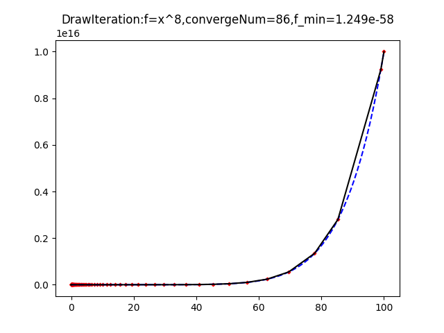

[[Debug]:[TestNewtonBFGS]isPasStr=caseSucceed case_f=x^2:
 initX=[100]
,lastfx=0.0,expectLessF=0.0,iterNum=24
,X=
[[0.]]
,grad=
[[0.]]
]
[[Debug]:[TestNewtonBFGS]isPasStr=caseSucceed case_f=x^8+x:
 initX=[100]
,lastfx=-0.6501225014974149,expectLessF=1e-05,iterNum=77
,X=
[[-0.74299714]]
,grad=
[[2.8077665e-08]]
]
[[Debug]:[TestNewtonBFGS]isPasStr=caseSucceed case_f= x^3-2*x +2:
 initX=[1.2]
,lastfx=0.9113378920963653,expectLessF=0.95,iterNum=27
,X=
[[0.81649658]]
,grad=
[[0.]]
]
[[Debug]:[TestNewtonBFGS]isPasStr=caseSucceed case_f=x^3 +1:
 initX=[1e-05]
,lastfx=-inf,expectLessF=-1e+36,iterNum=10
,X=
[[-9.35418799e+139]]
,grad=
[[2.62502499e+280]]
]
[[Debug]:[TestNewtonBFGS]isPasStr=caseSucceed case_f=x^2 -y^2:
 initX=[1, 1]
,lastfx=-2.5382791640938916e+189,expectLessF=-6e+119,iterNum=200
,X=
[[-2.92894385e-01]
 [ 1.51144014e+95]]
,grad=
[[ 5.85788746e-01]
 [-1.00762675e+95]]
]
[[Debug]:[TestNewtonBFGS]isPasStr=caseSucceed case_f=x^7 +1:
 initX=[0.5]
,lastfx=-inf,expectLessF=-4e+20,iterNum=8
,X=
[[-1.1225817e+215]]
,grad=
[[inf]]
]
[[Debug]:[TestNewtonBFGS]isPasStr=caseSucceed case_f=x^3 + y^3 +2:
 initX=[600, 10]
,lastfx=-inf,expectLessF=-2e+66,iterNum=8
,X=
[[-3.38867004e+104]
 [-1.12209252e+105]]
,grad=
[[3.44492539e+209]
 [3.77727488e+210]]
]
[[Debug]:[TestNewtonBFGS]isPasStr=caseSucceed case_f=x^7 + y^7+1:
 initX=[10, 1]
,lastfx=-inf,expectLessF=-4e+58,iterNum=5
,X=
[[-4.80935532e+57]
 [-3.03710485e+58]]
,grad=
[[inf]
 [inf]]
]
[[Debug]:[TestNewtonBFGS]isPasStr=caseSucceed case_f=1e-3x^7 + y^7+1:
 initX=[1, 100000.0]
,lastfx=-inf,expectLessF=-4e+58,iterNum=161
,X=
[[-8.45566747e-002]
 [-2.51435858e+233]]
,grad=
[[2.55849995e-09]
 [           inf]]
]
[[Debug]:[TestNewtonBFGS]isPasStr=caseSucceed case_f=1e-3x^7 + y^7+ z^7+1:
 initX=[1, 100000.0, 10]
,lastfx=-inf,expectLessF=-4e+58,iterNum=5
,X=
[[ 9.79845387e-001]
 [-2.32334254e+113]
 [-2.18370207e+252]]
,grad=
[[0.00619503]
 [       inf]
 [       inf]]
]
[[Debug]:[TestNewtonBFGS]isPasStr=caseSucceed case_f=1e-3x^15 + y^15+1:
 initX=[1, 100000.0]
,lastfx=-inf,expectLessF=-4e+58,iterNum=325
,X=
[[ 1.52993583e-02]
 [-3.81814737e+21]]
,grad=
[[5.77452528e-028]
 [2.09907946e+303]]
]
[[Debug]:[TestNewtonBFGS]isPasStr=caseSucceed case_f=x^8:
 initX=[0.1]
,lastfx=5.635944379389146e-101,expectLessF=1e-15,iterNum=22
,X=
[[-2.94354607e-13]]
,grad=
[[-1.5317428e-87]]
]
[[Debug]:[TestNewtonBFGS]isPasStr=caseSucceed case_f=x^8 + y^8:
 initX=[0.1, 0.2]
,lastfx=1.3822984162937259e-89,expectLessF=1e-15,iterNum=30
,X=
[[-1.14054775e-12]
 [ 7.80661298e-12]]
,grad=
[[-2.00855758e-79]
 [ 1.41360649e-77]]
]
[[Debug]:[TestNewtonBFGS]isPasStr=caseSucceed case_f=10*x^8 + y^8+20:
 initX=[10, 100]
,lastfx=20.0,expectLessF=20.01,iterNum=96
,X=
[[ 0.00630009]
 [-0.00145946]]
,grad=
[[ 3.15149847e-14]
 [-1.12833252e-19]]
]
[[Debug]:[TestNewtonBFGS]isPasStr=caseSucceed case_f=x^2 -y^2:
 initX=[1, 1]
,lastfx=-2.5382791640938916e+189,expectLessF=1e-15,iterNum=200
,X=
[[-2.92894385e-01]
 [ 1.51144014e+95]]
,grad=
[[ 5.85788746e-01]
 [-1.00762675e+95]]
]

pics:

